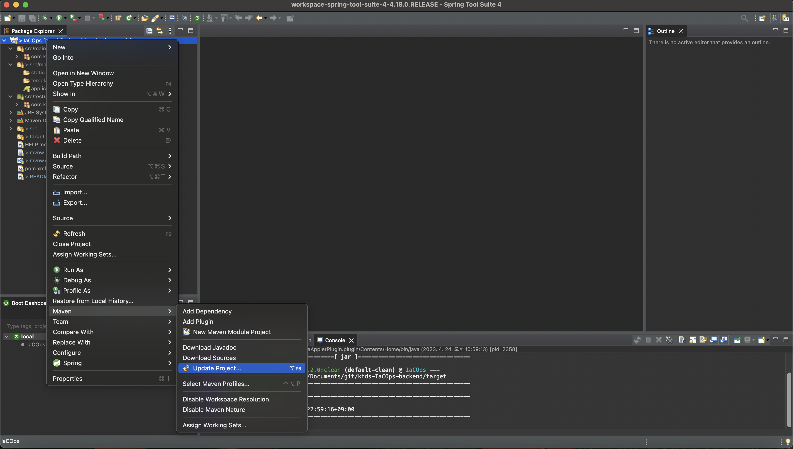

# ktds-IaCOps-backend
ktds IaCOps Project backend Source 

# Java 설치

- Java 1.8

# STS 다운로드 및 설치

* https://spring.io/tools
* 각 local 환경에 맞는 설치 파일 다운로드 및 설치

# Backend Source 다운로드

* https://github.com/jihun92/ktds-IaCOps-backend

# STS 설정

1. Git에서 받은 소스 Import

2. Maven update

# Maven Run

